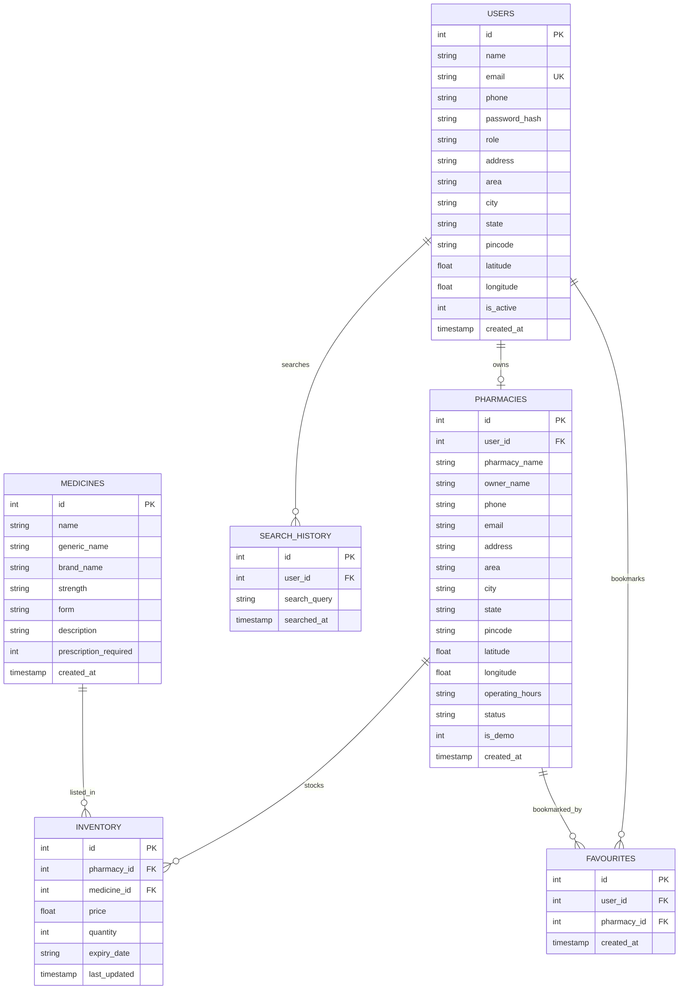

# Medicine Availability Finder

A complete, production-grade, end-to-end **Medicine Availability Finder** web application developed for a B.Tech college project using **Python Flask**, **SQLite**, and **HTML5/CSS3/JavaScript (Bootstrap 5)**.

---

## 1. Problem Statement
Patients and caregivers often struggle to find required medicines, visiting multiple pharmacies physically or making endless phone calls. Often, pharmacy information is outdated, leading to lost time during medical emergencies.

## 2. Solution
The **Medicine Availability Finder** provides a unified platform connecting patients, registered local pharmacies, and administrators:
- **Patients (Users):** Enter their location or use browser GPS to search medicines, view verified inventory across nearby pharmacies, check pricing, compute exact geographic distances, and get one-click map navigation.
- **Pharmacies:** Maintain their own live stock count, pricing, and batch expiry. Any stock update (e.g. 20 &rarr; 0) immediately reflects in user search results with an updated timestamp.
- **Administrators:** Review and approve newly registered pharmacies, manage users, and curate the master medicine catalog.

---

## 3. Technology Stack

| Layer | Technology | Details |
|---|---|---|
| **Frontend** | HTML5, CSS3, JavaScript, Bootstrap 5 | Modern Green & White healthcare design, responsive layout, live auto-suggestions, GPS geolocation |
| **Backend** | Python 3, Flask, REST APIs | Modular blueprints (`auth`, `user`, `medicine`, `pharmacy`, `admin`), Werkzeug password hashing |
| **Database** | SQLite 3 (`instance/medicine_finder.db`) | Parameterized SQL queries, foreign key constraints, indexes, clean relational schema |
| **Distance Engine** | Haversine Geographic Formula | Accurate great-circle distance computation in kilometers without paid API keys |
| **Mapping & Directions** | Standard Address / Geo URL Schemes | One-click directions without requiring paid Maps API keys |

---

## 4. Key Features

### 👤 User Capabilities
- **Registration & Login:** Secure password hashing with Werkzeug.
- **Location Management:** Browser Geolocation API (`navigator.geolocation`) + manual Address/Area/City/State/Pincode.
- **Medicine Search:** Partial match on medicine name, generic name, brand name, strength, and pharmaceutical form.
- **Nearby Pharmacy Locator:** Real-time lookup of approved pharmacies stocking the medicine, sorted by distance and availability.
- **Stock Status Indicator:** 🟢 Available (>10 units), 🟡 Low Stock (1–10 units), 🔴 Out of Stock (0 units).
- **Stock Freshness:** Explicit `last_updated` timestamp displayed on all inventory records.
- **Directions & Maps:** One-click Google Maps / Apple Maps navigation link.
- **Favourite Pharmacies:** Bookmark local pharmacies for quick access.
- **Search History:** Log of past searches with one-click re-search capability.

### 🏪 Pharmacy Capabilities
- **Pharmacy Registration:** Store address, manager details, operating hours, and coordinates (subject to admin approval).
- **Inventory Management:** Full CRUD operations on inventory (Medicine, Strength, Form, Price, Quantity, Expiry Date).
- **Real-Time Stock Updates:** Immediate database update when changing quantity or price.
- **Pharmacy Dashboard:** Real-time KPI counters (Total Medicines, Available, Low Stock, Out of Stock).

### 👨‍💼 Admin Capabilities
- **Pharmacy Verification:** Approve or reject newly registered pharmacies.
- **User Management:** Activate or deactivate user accounts.
- **Master Medicine Catalog:** Add, edit, or delete global medicine entries.
- **System Statistics:** Overview of total users, pharmacies, catalog medicines, and inventory records.

---

## 5. Pre-Seeded Demo Accounts

| Role | Email | Password | Details |
|---|---|---|---|
| **System Admin** | `admin@medfinder.com` | `Admin@123` | Full admin console access |
| **Demo User** | `user@medfinder.com` | `User@123` | Mohan Malicherla (Vizianagaram, AP) |
| **DemoCare Pharmacy** | `democare@pharmacy.com` | `Demo@123` | Cantonment, Vizianagaram (Approved) |
| **City Health Pharmacy** | `cityhealth@pharmacy.com` | `Demo@123` | RTC Complex Road, Vizianagaram (Approved) |
| **Community Medicals** | `community@pharmacy.com` | `Demo@123` | Ring Road, Vizianagaram (Approved) |
| **Student Health Pharmacy** | `studenthealth@pharmacy.com` | `Demo@123` | College Campus Road, Vizianagaram (Approved) |

> **Note:** All demo accounts and pharmacies are clearly labelled **"Demo Pharmacy — College Project"** for academic integrity.

---

## 6. Project Structure

```
medicine_availability_finder/
│
├── app.py                     # Flask application factory, filters, error handlers
├── config.py                  # App configuration & database path
├── database.py                # Database connection, schemas, and demo seed data
├── requirements.txt           # Python dependencies (Flask, Werkzeug)
├── test_app.py                # Automated unit & integration test suite
├── README.md                  # Project documentation
│
├── instance/
│   └── medicine_finder.db     # SQLite database
│
├── models/
│   ├── __init__.py
│   ├── user.py                # User authentication, profile, location models
│   ├── pharmacy.py            # Pharmacy creation, status, and profile models
│   ├── medicine.py            # Master medicines catalog models
│   ├── inventory.py           # Stock CRUD, Haversine distance, and search logic
│   ├── search_history.py      # User search logs
│   └── favourite.py           # User bookmarked pharmacies
│
├── routes/
│   ├── __init__.py
│   ├── auth.py                # Login, registration, role-based decorators
│   ├── user.py                # User dashboard, profile, favourites, history
│   ├── medicine.py            # Public search, medicine details, pharmacy details
│   ├── pharmacy.py            # Pharmacy dashboard, inventory management
│   └── admin.py               # Admin approval queue, catalog management
│
├── templates/
│   ├── base.html              # Responsive layout with medical disclaimer
│   ├── index.html             # Landing page with hero search bar
│   ├── login.html             # Role login page with test credentials helper
│   ├── register.html          # User registration
│   ├── pharmacy_register.html # Pharmacy partner registration
│   ├── search.html            # Search results with proximity & stock badges
│   ├── medicine_details.html  # Detailed medicine & pharmacies list
│   ├── pharmacy_details.html  # Pharmacy store profile & complete stock
│   ├── user_dashboard.html    # User welcome, recent searches, saved pharmacies
│   ├── pharmacy_dashboard.html# Pharmacy KPIs, inventory table, inline editor
│   ├── admin_dashboard.html   # Admin stats, approval queue, catalog manager
│   ├── profile.html           # User profile update
│   ├── location_settings.html # User manual / GPS location settings
│   ├── search_history.html    # User search logs
│   └── favourites.html        # Bookmarked pharmacies
│
└── static/
    ├── css/
    │   └── style.css          # Healthcare Green & White responsive CSS theme
    └── js/
        ├── main.js            # Geolocation helper, alerts, toast system
        ├── search.js          # Live auto-suggestions, GPS detect, favourites toggle
        ├── pharmacy.js        # Quick inline inventory edit, AJAX CRUD
        ├── admin.js           # Admin approval actions, medicine catalog modal
        └── user.js            # User GPS capture & profile helpers
```

---

## 7. Database Schema & Relationships



---

## 8. Installation & Setup Instructions

### Prerequisites
- Python 3.9+ (Python 3.10 / 3.11 / 3.12 / 3.14 tested)
- pip package manager

### Step 1: Clone or Navigate to Project Folder
```bash
cd "C:\Users\malicherla mohan\.gemini\antigravity\scratch\medicine_availability_finder"
```

### Step 2: Install Dependencies
```bash
pip install -r requirements.txt
```

### Step 3: Initialize Database & Seed Demo Data
```bash
python database.py
```

### Step 4: Run the Application
```bash
python app.py
```
Open your browser and navigate to:
```
http://127.0.0.1:5000
```

---

## 9. Running Automated Tests

Run the complete test suite verifying database integrity, Haversine formula, stock computation, pharmacy admin approval, security isolation, and end-to-end stock synchronization:

```bash
python -m unittest test_app.py -v
```

---

## 10. Important End-to-End Demonstration Workflow

### Step-by-Step College Demo:
1. **User Search Verification:**
   - Go to `http://127.0.0.1:5000`
   - Type `"Paracetamol"` in the search bar and click Search.
   - Observe **DemoCare Pharmacy** showing:
     - 🟢 **Available (20 in stock)**
     - Price: **₹25.00**
     - Distance calculated: **~0.82 km away**
     - Note the **Last Updated** timestamp.

2. **Pharmacy Stock Update:**
   - Log in as Pharmacy: `democare@pharmacy.com` / `Demo@123`
   - Go to the Pharmacy Dashboard (`/pharmacy/dashboard`).
   - Find Paracetamol in the inventory table.
   - Click the **Edit** (pencil) icon.
   - Change **Quantity from 20 to 0** and click **Save Changes**.

3. **Instant User Reflection:**
   - Search `"Paracetamol"` again as a patient.
   - Observe **DemoCare Pharmacy** now immediately showing:
     - 🔴 **Out of Stock**
     - A new, updated **Last Updated** timestamp.
   - This proves the genuine connection: **Frontend &rarr; Flask Backend &rarr; Database &rarr; Pharmacy Dashboard &rarr; Database &rarr; Backend &rarr; Frontend**.

---

## 11. Security & Compliance
- **Password Security:** Stored as salted cryptographic hashes (`scrypt`/`pbkdf2`) via `werkzeug.security`. Never stored in plain text.
- **SQL Injection Prevention:** 100% of database queries use parameterized SQL (`?` placeholders).
- **Cross-Pharmacy Isolation:** Strict verification prevents Pharmacy A from modifying or deleting Pharmacy B's inventory.
- **Medical Disclaimer:** Visible on all medicine and search pages:
  > *Medical Disclaimer: This website provides medicine availability and pharmacy information for informational purposes only. It does not provide medical advice, diagnosis, or treatment recommendations. Please consult a qualified healthcare professional before using any medicine.*
- **Realistic Availability Wording:** Transparently states:
  > *Availability is based on the latest inventory information provided by registered pharmacies.*

---

## 12. Future Enhancements
- Integration with SMS/WhatsApp alerts for out-of-stock medicine restock notifications.
- Prescription upload and verification system for Rx medicines.
- Multi-language localization for regional accessibility.
